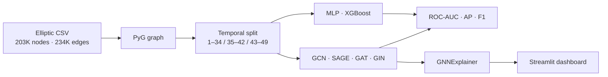

**English** | [中文](README.zh-CN.md)

<div align="center">

# GraphGuard

**Graph neural networks for illicit Bitcoin transaction detection**

*Fair graph-vs-tabular comparison · temporal leakage prevention · GNN explainability*

<a href="https://github.com/MeaFew/graphguard/actions"></a>


</div>

---

## Headline

> **Graph structure beats tabular features under a fair protocol.** After fixing three leakage paths, GraphSAGE reaches **0.793 test ROC-AUC / 0.062 AP**, ahead of the strongest tabular baseline, MLP (**0.727 / 0.047**). GNNExplainer also finds that roughly **24%** of important neighbors are illicit—about **12×** the all-node prior.

| Model | Test ROC-AUC | Test AP | Family |
|-------|-------------:|--------:|--------|
| **GraphSAGE** | **0.793** | **0.062** | GNN |
| MLP | 0.727 | 0.047 | Tabular |
| GCN | 0.718 | 0.049 | GNN |
| GAT | 0.717 | 0.049 | GNN |
| GIN | 0.707 | 0.049 | GNN |
| XGBoost | 0.702 | 0.045 | Tabular |

<p align="center">
  
</p>

> Sources: [`reports/metrics.json`](reports/metrics.json) and [`reports/model_comparison.csv`](reports/model_comparison.csv), using the same timestep 43–49 test split.

## What this project tests

Fraud is often a coordinated network behavior, but a stronger graph model is not evidence that topology helped unless the comparison prevents future-node leakage and uses the same split and preprocessing. GraphGuard tests this directly on the **Elliptic Bitcoin transaction dataset**.

| Property | Value |
|----------|-------|
| Transactions | 203,769 nodes |
| Edges | 234,355 |
| Time | 49 timesteps |
| Features | 168 (165 anonymous + 3 causal time features) |
| Labels | 42,019 licit · 4,545 illicit · 157,205 unknown |
| Imbalance | illicit ≈2.2% of all nodes; ≈9.8% of known labels |

## Leakage-safe protocol

An early version of this project showed "MLP beats GNN" — an artifact of three leakage paths, not a real result: feature scaling fitted on **all** nodes (including val/test), neighbor sampling over the **full** graph during training, and an MLP baseline fitted on train+val while XGBoost used train-only. After fixing all three, GraphSAGE legitimately wins. The current protocol:

1. **Non-overlapping temporal split:** train 1–34, validation 35–42, test 43–49.
2. **Split edge-filtered subgraphs:** training root nodes cannot aggregate validation or test node features (cross-split leakage prevention; per-edge time ordering within a split is not enforced).
3. **Train-only scaling:** `StandardScaler` is fitted on training nodes and then applied to later splits.
4. **Validation-only thresholding:** the F1 threshold is selected on validation PR curves and frozen for test.



## Explainability

GNNExplainer produces an auditable subgraph for high-confidence true positives. Across the selected explanations, important neighbors are 24–26% illicit, but the result is deliberately scoped: test AP is low, explanations focus on the most confident true positives, and roughly half of the selected nodes are mainly feature-driven.

<p align="center">
  
</p>

## Quick start

```bash
git clone https://github.com/MeaFew/graphguard.git
cd graphguard

python -m venv .venv
# Linux / macOS: source .venv/bin/activate
# Windows PowerShell: .venv\Scripts\Activate.ps1

make setup
# Windows without GNU Make:
# python -m pip install torch torchvision torchaudio --index-url https://download.pytorch.org/whl/cu121
# python -m pip install -r requirements.txt
# python -m pip install -e ".[dev]"

python run_all.py       # data → baselines → GNNs → evaluation → explanations → tests

# Or step by step:
make data        # download/generate data + build graph
make baselines   # train MLP + XGBoost
make gnn         # train GCN + SAGE + GAT + GIN
make evaluate    # metrics and plots
make explain     # GNN explainability (subgraphs + aggregate stats)
make test        # test suite

make dashboard          # interactive comparison UI
```

Without Kaggle credentials, the data stage falls back to a synthetic graph with similar structural characteristics. That path validates the pipeline only; the headline metrics above come from real Elliptic data.

## Project structure

```text
graphguard/
├── src/graphguard/              # data, training, evaluation, explanation modules
├── dashboard/app.py             # Streamlit comparison UI
├── tests/                       # leakage and explanation contracts
├── reports/                     # metrics, curves, explanation summaries
├── run_all.py                   # Windows-friendly orchestrator
└── Makefile                     # standard workflow entry points
```

## Limitations

- AP remains low under severe class imbalance and temporal drift: validation ROC-AUC reaches 0.88–0.94, but the later test window (timesteps 43–49) is substantially harder — a known property of the Elliptic benchmark. AP, not ROC-AUC, is used for model selection because the illicit class is only ~2%.
- The explanation sample emphasizes confident true positives and does not characterize false negatives.
- Synthetic fallback output must never be compared with real Elliptic metrics.

## Related projects

| Project | Focus |
|---------|-------|
| [shoplytics](https://github.com/MeaFew/shoplytics) | E-commerce behavior analytics · uplift modeling |
| [attributor](https://github.com/MeaFew/attributor) | Marketing attribution · budget optimization with confidence intervals |
| [riskscore](https://github.com/MeaFew/riskscore) | Credit scoring · WOE/IV + SHAP |
| [foresight](https://github.com/MeaFew/foresight) | Multivariate time-series forecasting · LSTM/Transformer |

## License

MIT. The Elliptic dataset is subject to its own Kaggle terms of use.
