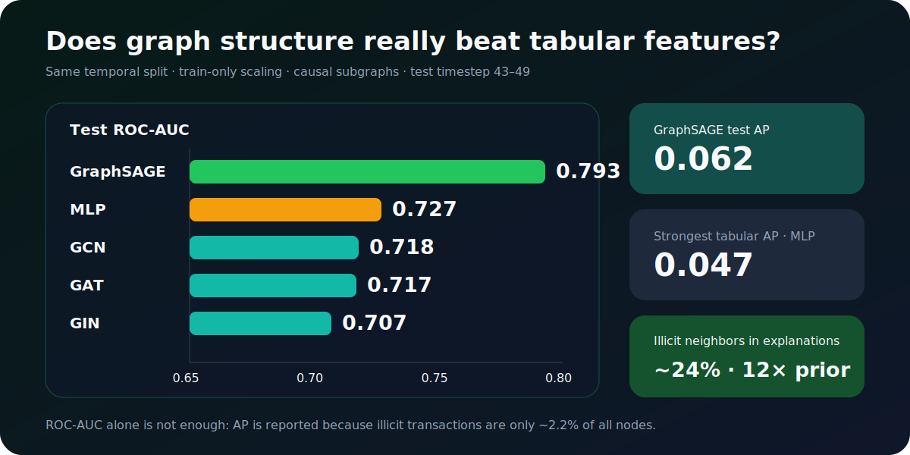
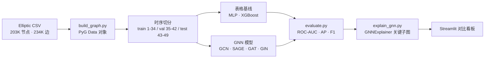
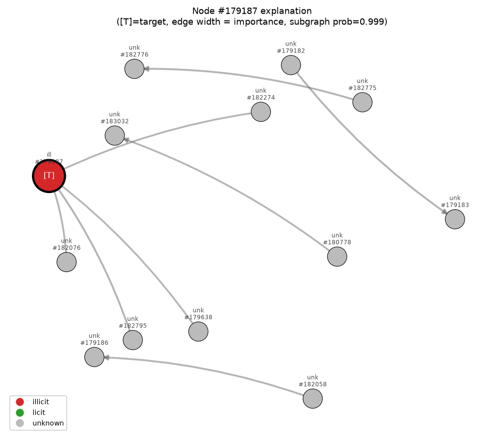

[English](README.md) | **中文**

<div align="center">

# GraphGuard

**图神经网络驱动的比特币交易反欺诈检测**

*证明图结构优于表格特征 · 时序防泄漏 · GNN 可解释性*

<a href="https://github.com/MeaFew/graphguard/actions"></a>


</div>

---

## 核心结论

> **图结构在公平对比下确实优于表格特征。** 修复三处数据泄漏后，GraphSAGE 的 test ROC-AUC 达 **0.793**，超过最强的表格基线（MLP 0.727）。在仅 AP=0.062 的弱模型上，GNNExplainer 仍揭示出欺诈节点的关键邻居中 illicit 占比 **~24%**——是全图先验（~2%）的 **12 倍**，印证了"欺诈呈团伙聚集"的结构信号。

| 模型 | Test ROC-AUC | Test AP | 类型 |
|------|:-----------:|:-------:|------|
| **GraphSAGE** | **0.793** | **0.062** | 🟢 GNN |
| MLP | 0.727 | 0.047 | 🟡 表格基线 |
| GCN | 0.718 | 0.049 | 🟢 GNN |
| GAT | 0.717 | 0.049 | 🟢 GNN |
| GIN | 0.707 | 0.049 | 🟢 GNN |
| XGBoost | 0.702 | 0.045 | 🟡 表格基线 |

> 指标来源：[`reports/metrics.json`](reports/metrics.json) 与 [`reports/model_comparison.csv`](reports/model_comparison.csv)，均使用 timestep 43–49 的同一测试切分。

<p align="center">
  
</p>

<details>
<summary><b>为什么 test 指标看起来低？</b>（点开看时序漂移与方法学说明）</summary>

验证集 ROC-AUC 达 0.88–0.94，但测试集（更晚的 timestep 43–49）明显更难——这是 Elliptic 基准的已知特性：欺诈模式随时间漂移。本项目用 **Average Precision（AP）** 作为模型选择指标（而非 ROC-AUC），因为 illicit 类只占 ~2%，ROC-AUC 被大量 licit 类主导，是糟糕的排序质量代理。
</details>

---

## 这个项目解决什么问题

反欺诈检测的传统做法是用交易自身的特征（金额、时间、地址……）训练 MLP / XGBoost。但欺诈是**团伙行为**——洗钱网络、连环盗刷都依赖交易间的拓扑关系。问题是：**图结构信息真的能提升检测吗？** 如果能，提升多少？在什么前提下成立？

`graphguard` 在 **Elliptic 数据集**（~20 万笔比特币交易、23 万条边、49 个时间步）上系统回答了这个问题：训练 4 种 GNN（GCN / GraphSAGE / GAT / GIN）对比 2 种表格基线（MLP / XGBoost），并严格保证对比的公平性。

---

## 项目亮点

- **证明 GNN 的价值需要先修复泄漏**：早期"MLP 击败 GNN"是三处泄漏造成的不公平对比假象（详见下文）。修复后 GraphSAGE 才真正胜出——这个发现本身就是项目最有价值的部分
- **时序防泄漏工程**：时间步不重叠切分 + 按 split 过滤边的子图采样（防跨 split 泄漏）+ 仅训练集 fit 的特征标准化，三层防护确保 GNN 是真归纳而非转导泄漏
- **GNN 可解释性**：用 GNNExplainer 输出"为什么这笔交易被判欺诈"的关键子图，把黑箱预测变成可审计的合规依据——金融方向作品集的稀缺深度点
- **诚实的方法学**：AP=0.062、模型在测试集欠自信、一半节点纯特征驱动——局限全部如实记录，不硬编故事

---

## 数据

| 属性 | 值 |
|------|-----|
| **数据集** | Elliptic Data Set（Kaggle 公开） |
| **规模** | 203,769 笔交易 · 234,355 条边 · 49 个时间步 |
| **特征** | 168 维（165 匿名 + 3 时间特征） |
| **类别** | licit 42,019 · illicit 4,545 · unknown 157,205 |
| **不平衡度** | illicit 占全部节点约 2.2%，占已知标签约 9.8% |

> 未配置 Kaggle 凭据时，自动 fallback 到合成交易图（相似统计特性），保证流水线可跑通。

---

## 技术架构



| 层级 | 技术选型 | 设计理由 |
|------|---------|---------|
| 图框架 | **PyTorch Geometric 2.8** | 原生支持 GNNExplainer，无需 captum |
| GNN 层 | GCNConv / SAGEConv / GATConv / GINConv | 覆盖频谱 / 归纳 / 注意力 / 同构区分四类范式 |
| 采样 | NeighborLoader（2-hop, [15,10]） | mini-batch 训练，8GB 显存可跑 |
| 评估 | Average Precision（模型选择） | 极不平衡下比 ROC-AUC 更诚实 |
| 解释 | `torch_geometric.explain` | 原生 GNNExplainer，输出边/特征掩码 |

---

## 防泄漏与公平性修正（重要）

早期版本的"MLP 击败 GNN"是三处泄漏造成的对比假象。修正后 GraphSAGE 才真正胜出：

<details>
<summary><b>三处泄漏的修复细节</b>（点开）</summary>

1. **特征标准化泄漏**（`build_graph.py`）：早期 `StandardScaler().fit_transform(x)` 跑在**全部**节点上（含 val/test），未来节点统计量泄漏进每个模型的输入。改为仅在 `train_mask` 行 fit，再 transform 全部。
2. **GNN 转导泄漏**（`train_gnn.py`）：早期 NeighborLoader 在全图采样，训练根节点的表示会聚合到 val/test 时间步的节点特征。改为每个 split 构建边过滤子图，仅保留两端 `time_step ≤ split 上限` 的边——训练根节点完全触达不了 val/test 节点。
3. **基线不公平**（`train_baseline.py`）：MLP 早期在 `train|val` 上拟合而 XGBoost 用 train-only + val 早停。MLP 改为仅在 `train_mask` 拟合后，其 headline ROC-AUC 从 0.810 降到 0.727。

这三处修复都有 `tests/test_graph.py::TestLeakagePrevention` 回归测试守护，防止复发。
</details>

---

## GNN 可解释性——从"预测"到"为什么"

### 为什么金融反欺诈必须可解释

预测一笔交易"是否欺诈"只解决了一半问题。在真实的 AML/KYC 合规场景里，监管机构（FinCEN、FATF）要求对每一笔被拦截的交易给出**可审计依据**。黑箱 GNN 给出"概率 0.97"无法满足审计；合规分析师需要的是"哪几笔上游交易的什么特征触发了判定"。GNNExplainer 把"概率"翻译成"关键子图 + 关键特征"。

```
   全图预测某个 illicit 节点 i 的 logit
                  │
                  ▼
   GNNExplainer: 优化边掩码 M, 使得「只保留 M 加权子图」时预测尽量接近原预测
                  │
                  ▼
   M 中权重高的边 ⟹ 对该预测最关键的邻接关系 ⟹ 输出"关键子图"
```

**一句话**：GNNExplainer 反问"砍掉哪些边后预测会变？"，留下来的就是模型的"理由"。

### 典型 illicit 解释子图

> `[T]` = 被解释的目标节点；边粗细 ∝ 重要性；红圈=illicit / 绿圈=licit / 灰圈=unknown

<div align="center">
  
</div>

该节点（prob=0.999）的判定**几乎完全由几条高权重入边驱动**——多笔 unknown 上游交易汇入单一汇聚点，这正是洗钱的典型拓扑。

### 聚合分析（跨 40 个高置信度 illicit 真阳性）

| 指标 | 结果 | 解读 |
|------|------|------|
| 关键邻居 illicit 占比（加权） | **~24%** | 远高于全图先验 ~2%，约 **12 倍富集** → 欺诈呈团伙聚集 |
| 关键邻居 unknown 占比 | ~68% | 大量关键邻居标签未知，是合规调查的天然候选 |
| 纯特征驱动（无入边）节点 | **20/40** | 一半判定不依赖图结构 → 对"图增益"叙事的诚实限定 |
| 最重要特征维度 | dim 136, 90, 165 | 跨节点聚合的匿名关键特征（Elliptic 特征无业务语义） |

<details>
<summary><b>诚实的方法学说明</b>（点开看选取策略与局限）</summary>

- **rank-based 选取**：测试集 illicit 极少且模型欠自信（169 个中仅 ~2 个 prob≥0.5，中位 ~0.03），故取预测概率排名最高的 40 个 TP 解释，叠加"至少一半须有入边"的结构配额。
- **AP=0.062、模型欠自信**：解释的是"模型最自信的 TP"，对漏掉（FN）的 illicit 意义有限，本项目没有对它们硬编故事。
- **一半节点纯特征驱动**：图结构对**聚集性欺诈**有用，对孤立特征可疑的交易未必。
- **GNNExplainer 有随机性**：单次关键边权重略有波动（邻居 illicit 占比 24–26%），但方向稳定，聚合统计可靠。
</details>

---

## 快速开始

```bash
git clone https://github.com/MeaFew/graphguard.git
cd graphguard

# 1. 创建并激活 Python 3.11 虚拟环境
python -m venv .venv
# Linux / macOS: source .venv/bin/activate
# Windows PowerShell: .venv\Scripts\Activate.ps1

# 2. 安装依赖与项目包（CUDA 12.1 / RTX 4060）
make setup
# Windows 无 GNU Make：python -m pip install torch torchvision torchaudio --index-url https://download.pytorch.org/whl/cu121
#                    python -m pip install -r requirements.txt
#                    python -m pip install -e ".[dev]"

# 3. 一键跑通完整流水线
python run_all.py

# 或分步执行
make data        # 下载/生成数据 + 构图
make baselines   # 训练 MLP + XGBoost
make gnn         # 训练 GCN + SAGE + GAT + GIN
make evaluate    # 评估与可视化
make explain     # GNN 可解释性（关键子图 + 聚合统计）
make test        # 运行测试套件

# 4. 启动对比看板
make dashboard
```

---

## 项目结构

```
graphguard/
├── src/graphguard/
│   ├── download_data.py        # 下载或生成数据集
│   ├── build_graph.py          # 构建 PyG Data（仅训练集标准化 + 时间特征）
│   ├── train_baseline.py       # MLP + XGBoost（仅训练集协议）
│   ├── train_gnn.py            # GCN / SAGE / GAT / GIN（split 边过滤子图）
│   ├── evaluate.py             # 指标与可视化
│   └── explain_gnn.py          # GNN 可解释性（GNNExplainer）
├── tests/
│   ├── test_graph.py           # 单元测试（含 TestLeakagePrevention）
│   └── test_explain.py         # Explainer 接入 / TP 选取 / 子图忠实度
├── dashboard/app.py            # Streamlit 对比看板
├── run_all.py · Makefile
└── reports/
    ├── images/explanations/    # 每个 illicit 节点的解释子图
    ├── metrics.json · model_comparison.csv
    └── explanation_summary.json
```

---

## 关键设计决策

1. **时序切分**：train/val/test 用不重叠时间步（1-34 / 35-42 / 43-49），标签绝不前向泄漏
2. **按 split 过滤边的子图**：每个 split 的 NeighborLoader 跑在边过滤子图上（只保留两端 `time_step ≤ split 上限` 的边），训练根节点触达不了 val/test 节点特征。注意这只防**跨 split** 泄漏，并未逐边强制 `ts_src ≤ ts_dst`——同 split 内根节点仍可能聚合到更晚时间步的邻居
3. **仅训练集标准化**：StandardScaler 在 train 节点 fit 后应用到全部
4. **val 调优的 F1 阈值**：决策阈值在验证集 PR 曲线上调优，再用于测试集——绝不在测试集上调
5. **归纳能力**：GraphSAGE / GIN 能泛化到训练时未见过的节点——在公平协议下 GraphSAGE 胜出

---

## 相关项目

| 项目 | 方向 |
|---------|------|
| [shoplytics](https://github.com/MeaFew/shoplytics) | 电商用户行为分析 · uplift 增益建模 |
| [attributor](https://github.com/MeaFew/attributor) | 营销归因 · 预算优化置信区间 |
| [riskscore](https://github.com/MeaFew/riskscore) | 信用评分 · WOE/IV + SHAP |
| [foresight](https://github.com/MeaFew/foresight) | 多变量时序预测 · LSTM/Transformer |

---

## License

MIT. The Elliptic dataset is subject to its own Kaggle terms of use.
